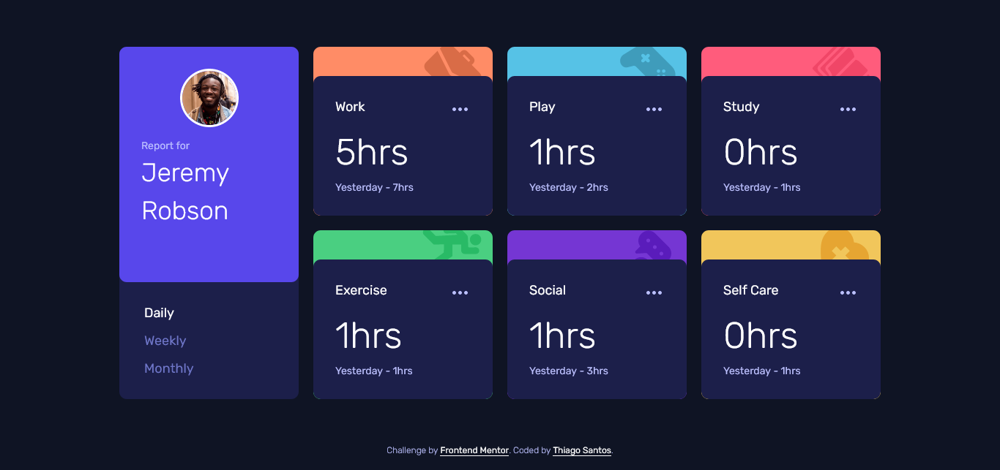

# Frontend Mentor - Time tracking dashboard solution

This is a solution to the [Time tracking dashboard challenge on Frontend Mentor](https://www.frontendmentor.io/challenges/time-tracking-dashboard-UIQ7167Jw). Frontend Mentor challenges help you improve your coding skills by building realistic projects.

## Table of contents

-   [Overview](#overview)
    -   [The challenge](#the-challenge)
    -   [Screenshot](#screenshot)
    -   [Links](#links)
-   [My process](#my-process)
    -   [Built with](#built-with)
    -   [What I learned](#what-i-learned)
-   [Author](#author)

## Overview

### The challenge

Users should be able to:

-   View the optimal layout for the site depending on their device's screen size
-   See hover states for all interactive elements on the page
-   Switch between viewing Daily, Weekly, and Monthly stats

### Screenshot

### Links

-   Solution URL: [https://www.frontendmentor.io/solutions/time-tracking-dashboard-css-grid-vanilla-js-H6eF4M_0E](https://www.frontendmentor.io/solutions/time-tracking-dashboard-css-grid-vanilla-js-H6eF4M_0E)
-   Live Site URL: [https://thiago-hds.github.io/frontend-mentor-solutions/junior/time-tracking-dashboard/](https://thiago-hds.github.io/frontend-mentor-solutions/junior/time-tracking-dashboard/)

## My process

### Built with

-   Semantic HTML5 markup
-   CSS custom properties
-   CSS Grid
-   Flexbox
-   Mobile-first workflow
-   Vanilla JS

### What I learned

-   MVC pattern
-   `transitionend` event

## Author

-   Frontend Mentor - [@thiago-hds](https://www.frontendmentor.io/profile/thiago-hds)
