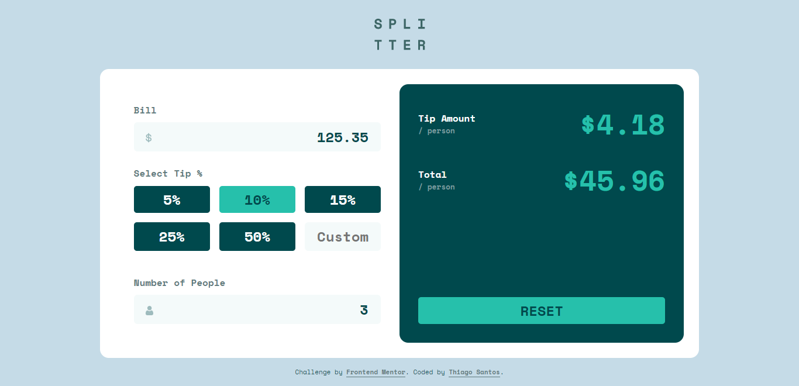

# Frontend Mentor - Tip calculator app solution

This is a solution to the [Tip calculator app challenge on Frontend Mentor](https://www.frontendmentor.io/challenges/tip-calculator-app-ugJNGbJUX). Frontend Mentor challenges help you improve your coding skills by building realistic projects.

## Table of contents

-   [Overview](#overview)
    -   [The challenge](#the-challenge)
    -   [Screenshot](#screenshot)
    -   [Links](#links)
-   [My process](#my-process)
    -   [Built with](#built-with)
    -   [What I learned](#what-i-learned)
    -   [Useful resources](#useful-resources)
-   [Author](#author)

## Overview

### The challenge

Users should be able to:

-   View the optimal layout for the app depending on their device's screen size
-   See hover states for all interactive elements on the page
-   Calculate the correct tip and total cost of the bill per person

### Screenshot



### Links

-   Solution URL: [https://www.frontendmentor.io/solutions/tip-calculator-app-vanilla-js-rylAOrJIX9](https://www.frontendmentor.io/solutions/tip-calculator-app-vanilla-js-rylAOrJIX9)
-   Live Site URL: [https://thiago-hds.github.io/frontend-mentor-solutions/junior/tip-calculator-app/](https://thiago-hds.github.io/frontend-mentor-solutions/junior/tip-calculator-app/)

## My process

### Built with

-   Semantic HTML5 markup
-   CSS custom properties
-   Flexbox
-   CSS Grid
-   Mobile-first workflow
-   Vanilla JS

### What I learned

I learned how to turn off the spinners displayed on number inputs by default:

```css
input[type='number']::-webkit-inner-spin-button,
input[type='number']::-webkit-outer-spin-button {
	appearance: none;
	margin: 0;
}
input[type='number'] {
	-moz-appearance: textfield;
}
```

### Useful resources

-   [CSS Tricks - Turn Off Number Input Spinners](https://css-tricks.com/snippets/css/turn-off-number-input-spinners/) - This helped to remove the spinners displayed on number inputs.

## Author

-   Frontend Mentor - [@thiago-hds](https://www.frontendmentor.io/profile/thiago-hds)
