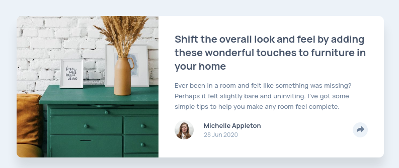
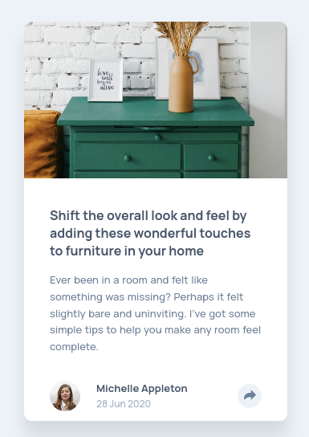

# Frontend Mentor - Article preview component solution

This is a solution to the [Article preview component challenge on Frontend Mentor](https://www.frontendmentor.io/challenges/article-preview-component-dYBN_pYFT). Frontend Mentor challenges help you improve your coding skills by building realistic projects.

## Table of contents

-   [Overview](#overview)
    -   [The challenge](#the-challenge)
    -   [Screenshot](#screenshot)
    -   [Links](#links)
-   [My process](#my-process)
    -   [Built with](#built-with)
    -   [What I learned](#what-i-learned)
-   [Author](#author)

## Overview

### The challenge

Users should be able to:

-   View the optimal layout for the component depending on their device's screen size
-   See the social media share links when they click the share icon

### Screenshot

  
  

### Links

-   Solution URL: [Here](https://www.frontendmentor.io/solutions/article-preview-component-htmlcss-grid-EcRX5YrH1)
-   Live Site URL: [Here](https://thiago-hds.github.io/frontend-mentor-solutions/newbie/article-preview-component/)

## My process

### Built with

-   Semantic HTML5 markup
-   CSS custom properties
-   CSS Grid

### What I learned

-   How to create a triangle with CSS
-   Property `visibility`

## Author

-   Frontend Mentor - [@thiago-hds](https://www.frontendmentor.io/profile/thiago-hds)
