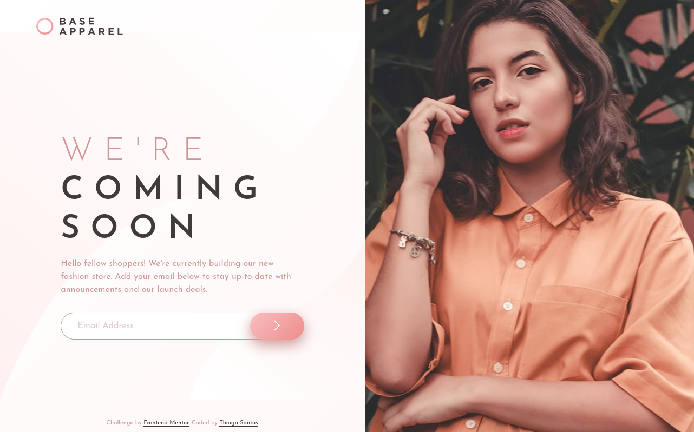

# Frontend Mentor - Base Apparel coming soon page solution

This is a solution to the [Base Apparel coming soon page challenge on Frontend Mentor](https://www.frontendmentor.io/challenges/base-apparel-coming-soon-page-5d46b47f8db8a7063f9331a0). Frontend Mentor challenges help you improve your coding skills by building realistic projects.

## Table of contents

-   [Overview](#overview)
    -   [The challenge](#the-challenge)
    -   [Screenshot](#screenshot)
    -   [Links](#links)
-   [My process](#my-process)
    -   [Built with](#built-with)
    -   [What I learned](#what-i-learned)
    -   [Useful resources](#useful-resources)
-   [Author](#author)

## Overview

### The challenge

Users should be able to:

-   View the optimal layout for the site depending on their device's screen size
-   See hover states for all interactive elements on the page
-   Receive an error message when the `form` is submitted if:
    -   The `input` field is empty
    -   The email address is not formatted correctly

### Screenshot

  
  

### Links

-   Solution URL: [Add solution URL here](https://your-solution-url.com)
-   Live Site URL: [Add live site URL here](https://your-live-site-url.com)

## My process

### Built with

-   Semantic HTML5 markup
-   CSS custom properties
-   Flexbox
-   CSS Grid
-   Mobile-first workflow

### What I learned

-   Form styling
-   Form validation with JavaScript
-   Some basic accessibility atributes such as `aria-label` and `aria-live`

### Useful resources

-   [Sara Soueidan- Accessible Icon Buttons](https://www.sarasoueidan.com/blog/accessible-icon-buttons/) - This helped me make the submit button accessible.

## Author

Frontend Mentor - [@thiago-hds](https://www.frontendmentor.io/profile/thiago-hds)
