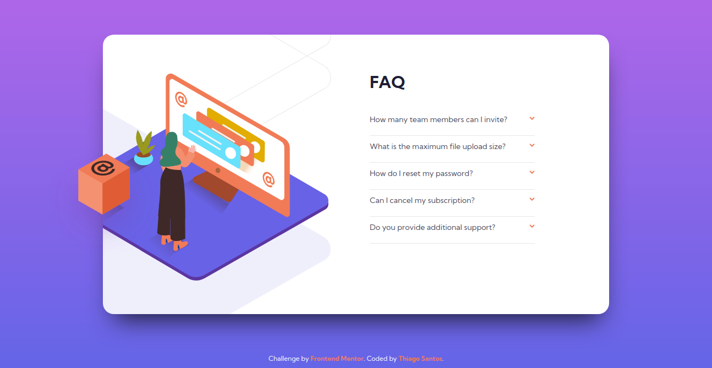
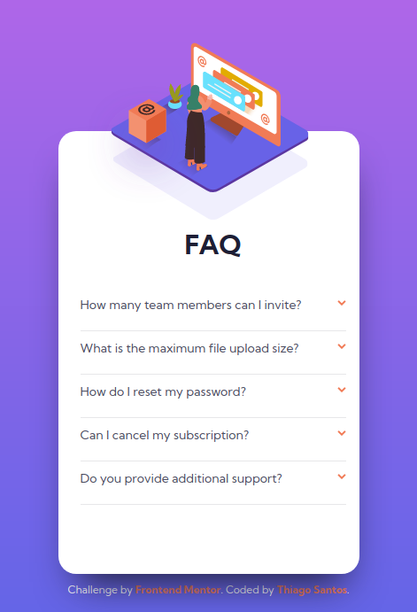

# Frontend Mentor - FAQ accordion card solution

This is a solution to the [FAQ accordion card challenge on Frontend Mentor](https://www.frontendmentor.io/challenges/faq-accordion-card-XlyjD0Oam). Frontend Mentor challenges help you improve your coding skills by building realistic projects.

## Table of contents

-   [Overview](#overview)
    -   [The challenge](#the-challenge)
    -   [Screenshots](#screenshots)
    -   [Links](#links)
-   [My process](#my-process)
    -   [Built with](#built-with)
-   [Author](#author)

## Overview

### The challenge

Users should be able to:

-   View the optimal layout for the component depending on their device's screen size
-   See hover states for all interactive elements on the page
-   Hide/Show the answer to a question when the question is clicked

### Screenshots

  
  

### Links

-   Solution URL: [https://www.frontendmentor.io/solutions/faq-accordion-html-css-flexbox-FtB9wUJk5](https://www.frontendmentor.io/solutions/faq-accordion-html-css-flexbox-FtB9wUJk5)
-   Live Site URL: [https://thiago-hds.github.io/frontend-mentor-solutions/newbie/faq-accordion-card/](https://thiago-hds.github.io/frontend-mentor-solutions/newbie/faq-accordion-card/)

## My process

### Built with

-   Semantic HTML5 markup
-   CSS custom properties
-   Flexbox
-   Mobile-first workflow

### What I learned

-   I've learned about the details/summary elements

## Author

-   Frontend Mentor - [@thiago-hds](https://www.frontendmentor.io/profile/thiago-hds)
