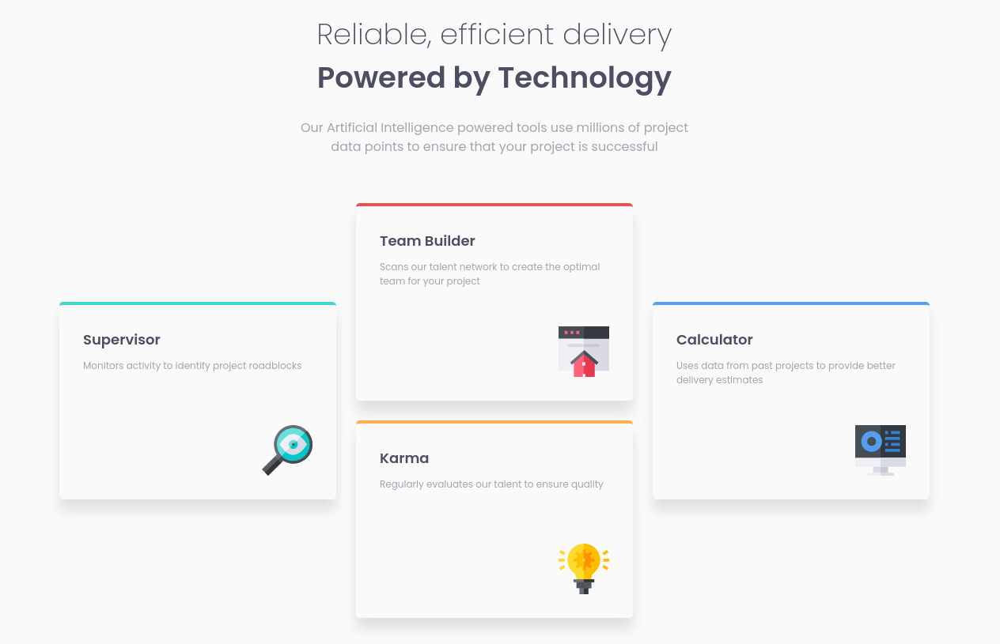
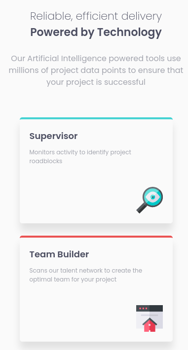

# Frontend Mentor - Four card feature section solution

This is a solution to the [Four card feature section challenge on Frontend Mentor](https://www.frontendmentor.io/challenges/four-card-feature-section-weK1eFYK). Frontend Mentor challenges help you improve your coding skills by building realistic projects.

## Table of contents

-   [Overview](#overview)
    -   [The challenge](#the-challenge)
    -   [Screenshot](#screenshot)
    -   [Links](#links)
-   [My process](#my-process)
    -   [Built with](#built-with)
    -   [What I learned](#what-i-learned)
-   [Author](#author)

## Overview

### The challenge

Users should be able to:

-   View the optimal layout for the site depending on their device's screen size

### Screenshot

  
  

### Links

-   Solution URL: [https://www.frontendmentor.io/solutions/four-card-feature-section-css-grid-cwDweBEws](https://www.frontendmentor.io/solutions/four-card-feature-section-css-grid-cwDweBEws)
-   Live Site URL: [https://thiago-hds.github.io/frontend-mentor-solutions/newbie/four-card-feature-section/](https://thiago-hds.github.io/frontend-mentor-solutions/newbie/four-card-feature-section/)

## My process

### Built with

-   Semantic HTML5 markup
-   CSS custom properties
-   CSS Grid
-   Mobile-first workflow

### What I learned

-   How to use relative units to create breakpoints

## Author

-   Frontend Mentor - [@thiago-hds](https://www.frontendmentor.io/profile/thiago-hds)
