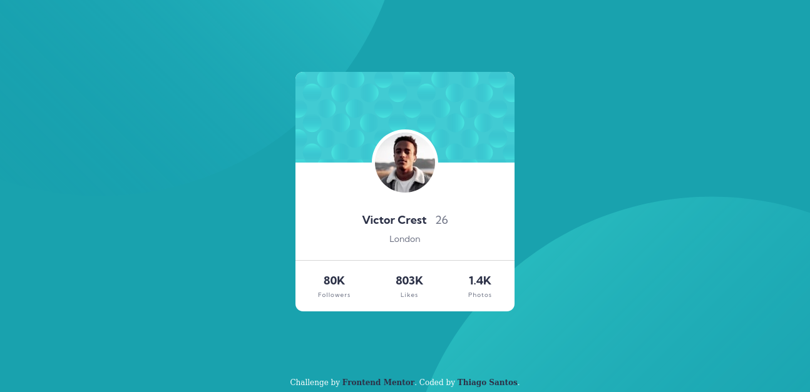

# Frontend Mentor - Profile card component solution

This is a solution to the [Profile card component challenge on Frontend Mentor](https://www.frontendmentor.io/challenges/profile-card-component-cfArpWshJ). Frontend Mentor challenges help you improve your coding skills by building realistic projects.

## Table of contents

-   [Overview](#overview)
    -   [The challenge](#the-challenge)
    -   [Screenshots](#screenshots)
    -   [Links](#links)
-   [My process](#my-process)
    -   [Built with](#built-with)
-   [Author](#author)

## Overview

### The challenge

-   Build out the project to the designs provided

### Screenshots

  

### Links

-   Solution URL: [https://www.frontendmentor.io/solutions/flexbox-solution-QuuwAzF9a](https://www.frontendmentor.io/solutions/flexbox-solution-QuuwAzF9a)
-   Live Site URL: [https://thiago-hds.github.io/frontend-mentor-solutions/newbie/profile-card-component/](https://thiago-hds.github.io/frontend-mentor-solutions/newbie/profile-card-component/)

## My process

### Built with

-   Semantic HTML5 markup
-   CSS custom properties
-   Flexbox

## Author

-   Frontend Mentor - [@thiago-hds](https://www.frontendmentor.io/profile/thiago-hds)
